## StreamSets SDK Kubernetes Deployment Example with Ingress
This project provides an example of how to use the [StreamSets Platform SDK](https://docs.streamsets.com/platform-sdk/latest/index.html) to programmatically deploy one or more [Data Collectors](https://streamsets.com/products/data-collector-engine/) (SDC) on Kubernetes with each Data Collector having either a Service and Ingress, or an externally reachable NodePort Service. This example may be useful if [Direct REST APIs](https://docs.streamsets.com/portal/platform-controlhub/controlhub/UserGuide/Engines/Communication.html#concept_dt2_hq3_34b) must be used rather than [WebSocket Tunneling](https://docs.streamsets.com/portal/platform-controlhub/controlhub/UserGuide/Engines/Communication.html#concept_hbg_fq3_34b).

The project creates one or more [Kubernetes Deployments](https://docs.streamsets.com/portal/platform-controlhub/controlhub/UserGuide/Deployments/Kubernetes.html#concept_ec3_cqg_hvb) of SDC using [Advanced Mode](https://docs.streamsets.com/portal/platform-controlhub/controlhub/UserGuide/Deployments/Kubernetes.html#concept_mqh_hjk_bzb) configuration with HTTPS-based access to the deployed Data Collectors.  

This project can be used to deploy SDC on Kubernetes with two different approaches. The first approach is best for use on Kubernetes environments that support LoadBalancer based ingress (like all public cloud Kubernetes providers). The second approach is best for use with on-prem layer-4 load balancers that mediate access to the Kubernetes cluster, or for single-instance standalone Kubernetes providers, for example Rancher running on your laptop.

### Approach #1 - Using an Ingress Controller with path-based routing

One or more single instance SDC Deployments will be deployed, each with a Service (either a ClusterIP or NodePort Service) and an Ingress, and a single Ingress Controller with path based routing, with  TLS terminated at the Ingress Controller, and with either HTTP or HTTPS-based communication from the Ingress Controller to the SDC backends. 

If you want to use a ClusterIP Service with an Ingress Controller (the preferred and most common approach), pay attention to these properties in your deployment.properties file (see below for details):
````
	LOAD_BALANCER_HOSTNAME    -- set this to the front end hostname of your Ingress Controller
	SERVICE_TYPE              -- set this to ClusterIP 
	BACKEND_PROTOCOL          -- set this to http or https
	SDC_KEYSTORE              -- if using https as the backend protocol, set this to the name of your keystore
	SDC_DEPLOYMENT_MANIFEST   -- set this to a yaml that includes an Ingress resource and a ClusterIP service (example yamls are provided)
````
    
If you want to use a NodePort Service with an Ingress Controller, make sure to set these properties as well:

````
	SERVICE_TYPE                    -- set this to NodePort
	STARTING_NODE_PORT_SERVICE_PORT -- set this to a value between 30000 and 32767
	SDC_DEPLOYMENT_MANIFEST         -- set this to a yaml that includes an Ingress resource and a NodePort service (example yamls are provided)
````
	
The ingress examples below use [ingress-nginx](https://kubernetes.github.io/ingress-nginx/) as an Ingress Controller on both Azure Kubernetes Service (AKS) and Amazon Elastic Kubernetes Service (EKS).


### Approach #2 - Using externally reachable NodePort Services without an Ingress Controller

One or more single instance SDC Deployments configured for HTTPS will be deployed, each with a NodePort Service so that the SDCs are externally reachable.  No Ingress or Ingress Controllers are needed.
Make sure to set these properties:
````
	LOAD_BALANCER_HOSTNAME           -- set this to any reachable node in the Kubernetes cluster or to a layer-4 load balancer that sits in front of the cluster
	SERVICE_TYPE                     -- set this to NodePort
	BACKEND_PROTOCOL                 -- set this to https
	SDC_KEYSTORE                     -- set this to the name of your keystore
	SDC_DEPLOYMENT_MANIFEST          -- set this to a yaml that includes an NodePort Service and that does not include an Ingress (example yamls are provided) 
	STARTING_NODE_PORT_SERVICE_PORT  -- set this to a value between 30000 and 32767
	USE_NODE_PORT_INSTEAD_OF_INGRESS -- set this to true
````      
The property <code>USE_NODE_PORT_INSTEAD_OF_INGRESS</code> ensures that SDC URLs are of the form <code>https:\/\/\<hostname\>:\<port\></code> rather than of the form <code>https:\/\/\<hostname\>/\<path\></code> used when there is an ingress controller that perfoms path-based routing


### Prerequisites

- A Python 3.6+ environment with the StreamSets Platform SDK v6.1+ module installed 

- The StreamSets Organization should have the property [Enable WebSocket Tunneling for UI Communication](https://docs.streamsets.com/portal/platform-controlhub/controlhub/UserGuide/OrganizationSecurity/MyOrganization_title.html#task_whz_qjv_tqb) disabled.

- An existing Kubernetes cluster with the ability to deploy an Ingress Controller if ingress will be configured.  

- [API Credentials](https://docs.streamsets.com/portal/platform-controlhub/controlhub/UserGuide/OrganizationSecurity/APICredentials_title.html#concept_vpm_p32_qqb) for a user with permissions to create Deployments 

- If an Ingress Controller is used, it must support [regex-based URL path matching](https://kubernetes.github.io/ingress-nginx/user-guide/ingress-path-matching/) and path-based routing (both of which are supported by ingress-nginx)


### Versions used in the example

This example uses:

- ingress-nginx v1.10.0

- StreamSets Data Collector v5.10.0

- StreamSets Kubernetes Agent v1.1.2

- AKS with Kubernetes v1.28.5

- EKS with Kubernetes v1.29

- Rancher v2.7.5 in standalone (single node) mode, with Kubernetes v1.26.4 +k3s1 (used for the NodePort Service example)


## Deploying the Example

### Create a Namespace for the StreamSets Deployments
Create a namespace for the StreamSets Deployment:

<code>$ kubectl create ns ns1</code>


### Deploy the Ingress Controller (not needed for the NodePort Service Example)

- For AKS, install ingress-nginx v1.10.0 using this command:

<code>$ kubectl apply -f https://raw.githubusercontent.com/kubernetes/ingress-nginx/controller-v1.10.0/deploy/static/provider/cloud/deploy.yaml</code>

- For EKS, install ingress-nginx v1.10.0 using this command:

<code>$ kubectl apply -f https://raw.githubusercontent.com/kubernetes/ingress-nginx/controller-v1.10.0/deploy/static/provider/aws/deploy.yaml</code>


### Get the External IP for the Ingress Controller's Load Balancer Service (not needed for the NodePort Service Example)

- On AKS, the external IP will be an IP Address:

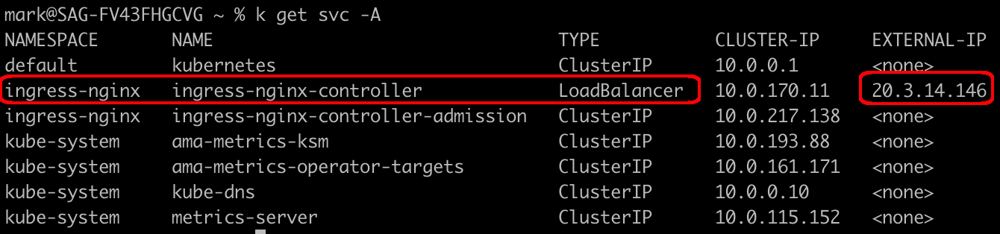

- On EKS, the external IP will be a hostname (the full hostname is truncated in this screenshot):

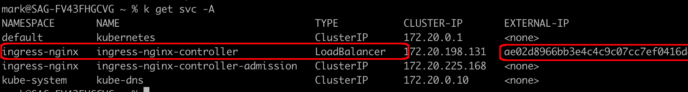

The full external IP value for my EKS LoadBalancer Service is:

    ae02d8966bb3e4c4c9c07cc7ef0416da-7f39be11bd31e542.elb.us-west-2.amazonaws.com

### Map a DNS Name to the Load Balancer's IP 

If you want to use your own DNS name, private key, and cert for the SDC ingress (to support HTTPS), start by mapping your own DNS name to the LoadBalancer's external IP.  I'll add DNS entries to my domain <code>onefoursix.com</code>:

- For AKS, I added an A record to my DNS to map the name <code>aks.onefoursix.com</code> to the AKS Load Balancer's external IP of 20.3.14.146, and confirm that using <code>nslookup</code>:

```
	$ nslookup aks.onefoursix.com
	Server:		10.10.10.1
	Address:	10.10.10.1#53
	Non-authoritative answer:
	Name:	aks.onefoursix.com
	Address: 20.3.14.146
```
	
- For EKS, I added a CNAME record to my DNS to map the name <code>eks.onefoursix.com</code> to the EKS Load Balancer's external hostname, and confirm that using <code>nslookup</code>:

```
	$ nslookup eks.onefoursix.com
	Server:		10.10.10.1
	Address:	10.10.10.1#53
	Non-authoritative answer:
	eks.onefoursix.com	canonical name = ae02d8966bb3e4c4c9c07cc7ef0416da-7f39be11bd31e542.elb.us-west-2.amazonaws.com.
	Name:	ae02d8966bb3e4c4c9c07cc7ef0416da-7f39be11bd31e542.elb.us-west-2.amazonaws.com
	Address: 44.230.94.122
	Name:	ae02d8966bb3e4c4c9c07cc7ef0416da-7f39be11bd31e542.elb.us-west-2.amazonaws.com
	Address: 44.224.0.85
```

- For Rancher I added an A record to my DNS to map the name <code>rancher.onefoursix.com</code> to the IP address of my single Rancher node.

### Set a TLS key and cert for the Load Balancer's DNS name (not needed for the NodePort Service Example)
In this example, the ingress controller terminates TLS and can be configured to use either HTTP or HTTPS to connect to backend SDCs. A TLS key and cert is not necessary if the ingress is a Layer-4 load balancer just doing TCP passthrough without terminating TLS. 

I'll use my own wildcard cert and key for <code>*.onefoursix.com</code> in the files <code>tls.crt</code> and <code>tls.key</code> respectively. 

Store the TLS key and cert in a Kubernetes tls Secret:

	$ kubectl create secret -n ns1 tls streamsets-tls \
    	--key ~/certs/tls.key --cert ~/certs/tls.crt
    	
For the NodePort Service example running on Rancher, the NodePort Service just does TCP passthrough to the SDC Pods, and we'll configure SDC to use HTTPS with its own keystore. No other TLS configuration is needed.

### Set an SDC keystore and password

If you are using an Ingress Controller and its backend protocol is <code>HTTP</code>, SDC does not need a keystore

However, if the backend protocol is <code>HTTPS</code> we'll need to set a custom keystore for SDC. I'll package the same TLS key and cert I used for the load balancer into a keystore named <code>onefoursix.p12</code>, and save that keystore in a Kubernetes Secret named sdc-keystore:

    $ kubectl -n ns1 create secret generic sdc-keystore --from-file=onefoursix.p12

I'll also save the keystore password in a secret named sdc-keystore-password

	$ kubectl -n ns1 create secret generic sdc-keystore-password --from-file=keystore-password.txt

Note that for the NodePort Service example, SDC must use HTTPS with its own keystore

### Create a Kubernetes Environment

The [Kubernetes Environment](https://docs.streamsets.com/portal/platform-controlhub/controlhub/UserGuide/Environments/Kubernetes.html#concept_l1w_h4g_2vb) needs to exist in advance.

- For AKS, I'll create a new Kubernetes Environment named <code>aks-ns1</code> and set the namespace to <code>ns1</code>.

- For EKS, I'll create a new Kubernetes Environment named <code>eks-ns1</code> and set the namespace to <code>ns1</code>.

- For Rancher, I'll create a new Kubernetes Environment named <code>rancher</code> and set the namespace to <code>ns1</code>.


Activate your environment but do not play the generated shell command; instead, click the <code>View Kubernetes YAML</code> button. In the dialog that opens, click the <code>copy</code> button. Paste the text into a text document on your local machine named <code>agent.yaml</code> (the name is not critical).

#### Edit the generated YAML for the Agent
On or around line 21, replace this line:

    resources: ["pods"]

with this line:

	resources: ["pods", "services"]

And add this new section:

```
- apiGroups: ["networking.k8s.io"]
  resources: ["ingresses"]
```

Those changes will allow the Kubernetes Agent to create Service and Ingress resources

The updated rules section in the Role resource should look like this:

```
rules:
  - apiGroups: [""]
    resources: ["pods", "services"]
    verbs: ["get", "list", "create", "patch", "delete"]
  - apiGroups: ["networking.k8s.io"]
    resources: ["ingresses"]
    verbs: ["get", "list", "create", "patch", "delete"]
  - apiGroups: [""]
    resources: ["secrets"]
    verbs: ["get", "list", "create", "patch", "delete"]
  - apiGroups: ["apps"]
    resources: ["deployments", "replicasets"]
    verbs: ["get", "list", "create", "patch", "delete"]
  - apiGroups: ["autoscaling"]
    resources: ["horizontalpodautoscalers"]
    verbs: ["get", "list", "create", "patch", "delete"]
```


Also, if you need to set a proxy for the Kubernetes Agent, set that on or around line 102 as the value for the environment variable <code>STREAMSETS_KUBERNETES_AGENT_JAVA_OPTS</code> (for details on this step, see the docs [here](https://docs.streamsets.com/portal/platform-controlhub/controlhub/UserGuide/Environments/Kubernetes.html#task_tgv_rrg_lwb)).


#### Deploy the Kubernetes Agent
Apply the <code>agent.yaml</code> script to deploy the Agent:

	$ kubectl apply -f agent.yaml

Make sure the Kubernetes Agent comes online for the Environment. For example, here is my Kubernetes Agent for my aks-ns1 deployment: 

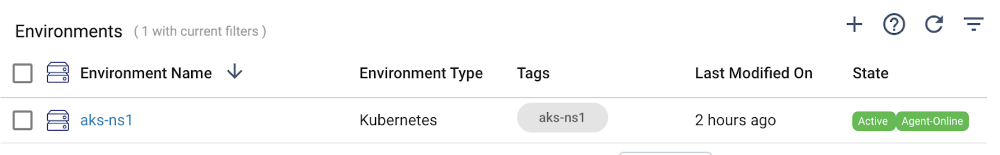

### Configure a Kubernetes Deployment
Clone this project to your local machine. 

#### Create a deployment.properties file
Create a deployment.properties file (the file name and location are not criticial). You can start by copying one of the example properties files in the [config/examples](config/examples) directory, and/or you can refer to the [config/deployment.properties.template](config/deployment.properties.template) for documentation and examples of each property. 

For example, here is a <code>deployment.properties</code> file for an AKS environment that uses HTTPS for a backend protocol with a custom keystore, and a ClusterIP service:

```
[deployment]
SCH_URL=https://<your-region>.hub.streamsets.com
ORG_ID=xxxxxxxx
LOAD_BALANCER_HOSTNAME=lb.acme.com
SERVICE_TYPE=ClusterIP
BACKEND_PROTOCOL=https
SDC_KEYSTORE=your-custom-keystore.p12
SDC_DEPLOYMENT_MANIFEST=yaml/clusterIP-ingress-keystore.yaml
SDC_VERSION=5.10.0
DEPLOYMENT_TAGS=k8s-sdc-5.10.0,california
USER_STAGE_LIBS=apache-kafka_3_4,aws,aws-secrets-manager-credentialstore,jdbc,jython_2_7,sdc-snowflake
ENGINE_LABELS=dev,california
SDC_MAX_CPU_LOAD=90.0
SDC_MAX_MEMORY_USED=95.0
SDC_MAX_PIPELINES_RUNNING=10
SDC_JAVA_MIN_HEAP_MB=2024
SDC_JAVA_MAX_HEAP_MB=2024
SDC_JAVA_OPTS=""
REQUESTS_MEMORY=3Gi
LIMITS_MEMORY=3Gi
REQUESTS_CPU=1000m
LIMITS_CPU=3000m
```

#### Using a custom ServiceAccount for SDC
If you want to use a custom ServiceAccount for SDC, make sure the ServiceAccount exists in advance and is bound to a role that grants read permissions on secrets, and then set the <code>SDC_SERVICE_ACCOUNT</code> property in your <code>deployment.properties</code>.  If that property is not included in the <code>deployment.properties</code> file or is not set, the <code>default</code> ServiceAccount will be used.

See the manifest [here](yaml/create-sdc-sa-example.yaml) for an example of how to create a ServiceAccount, Role, and RoleBinding with the appropriate RBAC permission.

#### Service Types
Most commonly, the <code>SERVICE_TYPE</code> property will be set to <code>ClusterIP</code>. However, if you want to create <code>NodePort</code> services, set the <code>SERVICE_TYPE</code> property to <code>NodePort</code> and also set the <code>STARTING_NODE_PORT_SERVICE_PORT</code> property to a value between 30000 and 32767.  If multiple deployments are created in a single run, this starting value will be incremented by 1 for each subsequent deployment.

Use one of the ClusterIP-based deployment.properties and yaml examples if you are using a ClusterIP Service, and use one of the NodePort examples if you are using a NodePort Service.

If you are using NodePort Services without an ingress controller, start with the [deployment.property example that does not have an ingress](config/examples/nodeport-instead-of-ingress-deployment-example.properties) that refers to a [manifest without an ingress](yaml/node-port-no-ingress.yaml). Also, make sure to set <code>USE_NODE_PORT_INSTEAD_OF_INGRESS=true</code> in your deployment.properties file as that will cause the SDC URLs to be of the form <code>https:\/\/\<hostname\>:\<port\></code> rather than of the form <code>https:\/\/\<hostname\>/\<path\></code> used when there is an ingress controller that perfoms path-based routing.


#### Edit additional config files  (optional) 

Edit any of the additional files in the project's <code>etc</code> directory as needed, including:

	credential-stores.properties
	proxy.properties
	sdc-log4j2.properties
	security.policy
	
 
Note that the included <code>sdc.properties</code> file is a template that contains tokens like <code>${SDC_BASE_HTTP_URL}</code> that will be replaced by the Python script.  Change any other properties as needed.


#### Edit the deployment manifest (optional) 

Edit the manifest file referenced by your deployment.properties if needed as well.  Note that many of the property values, like <code>${DEP_ID}</code> will be replaced by the Python script. 


### Set your API Credentials
Create a file named <code>sdk-env.sh</code> with your[API credentials](https://docs.streamsets.com/portal/platform-controlhub/controlhub/UserGuide/OrganizationSecurity/APICredentials_title.html#concept_vpm_p32_qqb) in the project's [private](private) directory as quoted strings with no spaces, like this:

	export CRED_ID="esdgew……193d2"
	export CRED_TOKEN="eyJ0…………J9."

### Deploy a single SDC
Make the script <code>create-k8s-deployment.sh</code> executable:

	$ chmod +x create-k8s-deployment.sh

Execute the script, passing it three args: 

- The name of your deployment properties file
- The name of your StreamSets Kubernetes Environment
- A Deployment suffix.  

For example:

	./create-k8s-deployment.sh config/deployment.properties aks-ns1 sdc1

If all goes well you should see console output like this:
```
$ ./create-k8s-deployment.sh config/deployment.properties aks-ns1 sdc1

---------
Creating StreamSets Deployment
Deployment Properties File:  config/deployment.properties
Environment Name:  aks-ns1
Deployment Suffix:  sdc1
---------

2024-04-21 21:30:06 Connecting to Control Hub
2024-04-21 21:30:08 Getting the environment
2024-04-21 21:30:08 Using namespace 'ns1'
2024-04-21 21:30:08 Creating deployment 'aks-ns1-sdc1'
2024-04-21 21:30:08 SDC Version: 5.10.0
2024-04-21 21:30:08 Deployment Tags: ['k8s-sdc-5.10.0', 'california']
2024-04-21 21:30:10 Adding Stage Libs: ['apache-kafka_3_4', 'aws', 'aws-secrets-manager-credentialstore', 'jdbc', 'jython_2_7', 'sdc-snowflake']
2024-04-21 21:30:10 ---
2024-04-21 21:30:10 Setting values in sdc.properties:
2024-04-21 21:30:10 - Setting URL to https://aks.onefoursix.com/sdc1/
2024-04-21 21:30:10 - Setting http.port to -1
2024-04-21 21:30:10 - Setting https.port to 18630
2024-04-21 21:30:10 - Setting keystore to 'onefoursix.p12'
2024-04-21 21:30:10 ---
2024-04-21 21:30:10 Loading credential-stores.properties
2024-04-21 21:30:10 Loading security.policy
2024-04-21 21:30:10 Loading sdc-log4j2.properties
2024-04-21 21:30:10 Loading proxy.properties
2024-04-21 21:30:11 ---
2024-04-21 21:30:11 Setting values in yaml template 'yaml/sdc-service-ingress-keystore.yaml':
2024-04-21 21:30:11 - Setting '${DEP_ID}' to '40f07026-233f-49b8-8070-864ff3b2a364'
2024-04-21 21:30:11 - Setting '${NAMESPACE}' to 'ns1'
2024-04-21 21:30:11 - Setting '${SDC_VERSION}' to '5.10.0'
2024-04-21 21:30:11 - Setting '${ORG_ID}' to '20677965-affe-11ee-b630-8d34cf7885a7'
2024-04-21 21:30:11 - Setting '${SCH_URL}' to 'https://na01.hub.streamsets.com'
2024-04-21 21:30:11 - Setting '${REQUESTS_MEMORY}' to '1Gi'
2024-04-21 21:30:11 - Setting '${LIMITS_MEMORY}' to '2Gi'
2024-04-21 21:30:11 - Setting '${REQUESTS_CPU}' to '1000m'
2024-04-21 21:30:11 - Setting '${LIMITS_CPU}' to '3000m'
2024-04-21 21:30:11 - Setting '${DEPLOYMENT_SUFFIX}' to 'sdc1'
2024-04-21 21:30:11 - Setting '${SERVICE_TYPE}' to 'ClusterIP'
2024-04-21 21:30:11 - Setting '${SERVICE_PORT}' to '18630'
2024-04-21 21:30:11 - Setting '${LOAD_BALANCER_HOSTNAME}' to 'aks.onefoursix.com'
2024-04-21 21:30:11 - Setting '${BACKEND_PROTOCOL}' to 'HTTPS'
2024-04-21 21:30:11 - Setting '${KEYSTORE}' to 'onefoursix.p12'
2024-04-21 21:30:11 ---
2024-04-21 21:30:12 Done
```


#### Inspect the Deployment
You should see a new Deployment in Control Hub in a Deactivated state.  (You can uncomment the second to last line in the Python script to have Deployments autostart once you have confidence in the process.)

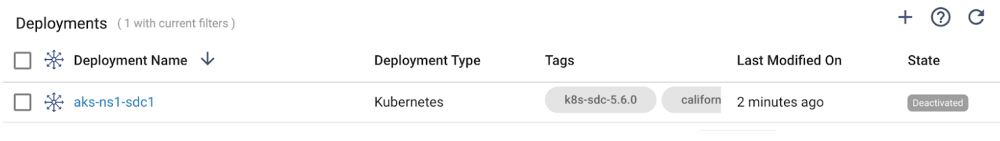

Inspect the stage libraries, labels, and all other configuration to confirm the Deployment was created as desired.  

When editing the Deployment you should be placed in the Advanced Kubernetes pane and you can inspect the generated manifest, including the Service and Ingress:

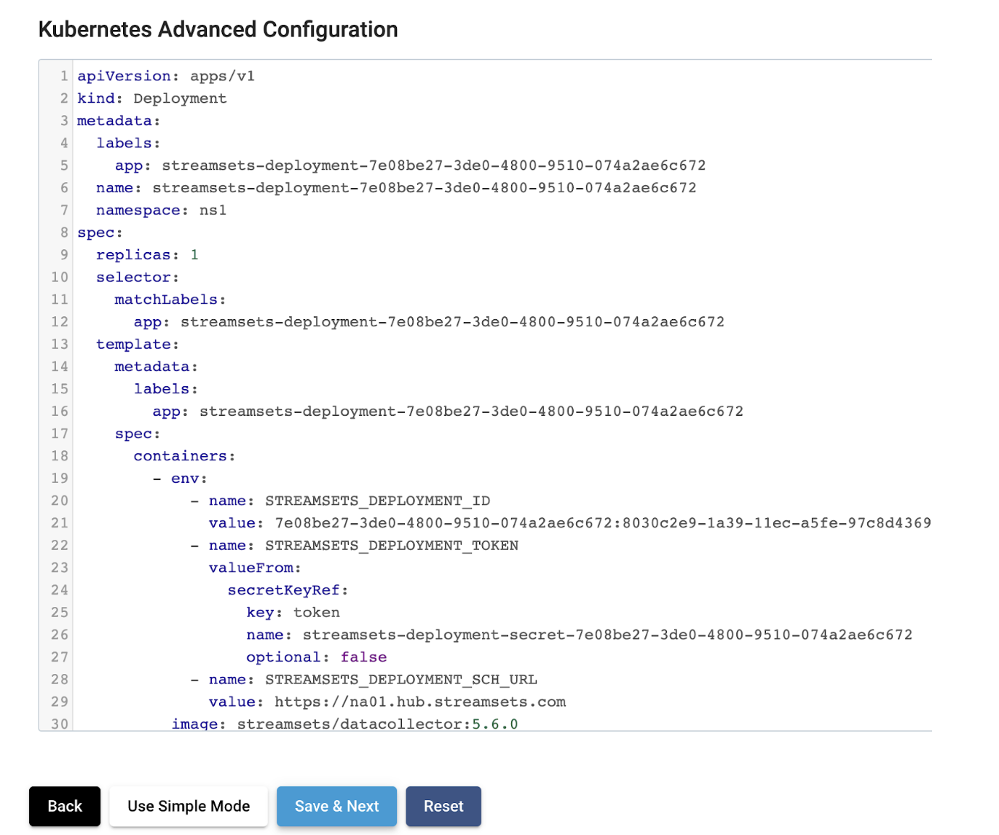

### Start the Deployment

Start the Deployment and it should transition to Activating and then to Active:

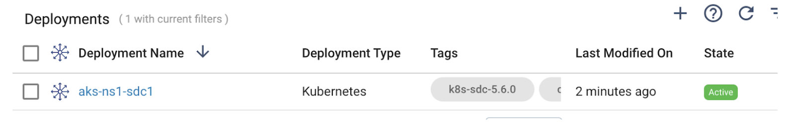

The Engine should register with Control Hub with its path-based URL:

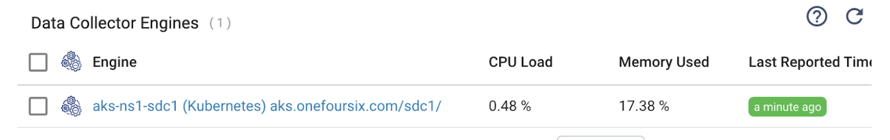

The Data Collector should be accessible for Authoring:

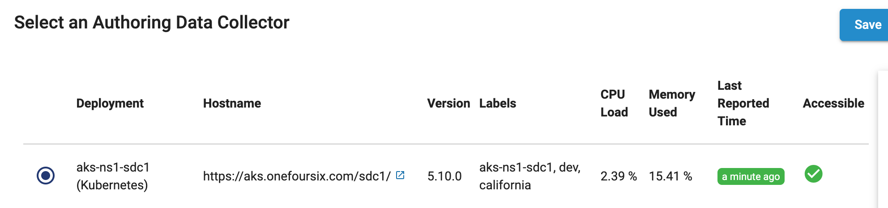

### Create multiple deployments
Make the script <code>create-multiple-k8s-deployments.sh</code> executable: 

	$ chmod +x create-multiple-k8s-deployments.sh

Execute the script, passing it three args: 

- The name of your deployment properties file 
- The name of your StreamSets Kubernetes Environment
- A comma-delimited-list of Deployment suffixes.  

For example:

	./create-multiple-k8s-deployments.sh config/deployment.properties aks-ns1 sdc1,sdc2,sdc3

If all goes well you should see console output like this:

```
$ ./create-multiple-k8s-deployments.sh config/deployment.properties aks-ns1 sdc1,sdc2,sdc3

---------
Creating StreamSets Deployments
Deployment Properties File:  config/deployment.properties
Environment Name:  aks-ns1
Deployment Suffixes:  sdc1,sdc2,sdc3
---------

---------
Creating StreamSets Deployment
Environment Name aks-ns1
SDC Suffix: sdc1
---------
2024-04-21 21:49:02 Connecting to Control Hub
2024-04-21 21:49:03 Getting the environment
2024-04-21 21:49:04 Using namespace 'ns1'
2024-04-21 21:49:04 Creating deployment 'aks-ns1-sdc1'
2024-04-21 21:49:04 SDC Version: 5.10.0
2024-04-21 21:49:04 Deployment Tags: ['k8s-sdc-5.10.0', 'california']
2024-04-21 21:49:06 Adding Stage Libs: ['apache-kafka_3_4', 'aws', 'aws-secrets-manager-credentialstore', 'jdbc', 'jython_2_7', 'sdc-snowflake']
2024-04-21 21:49:06 ---
2024-04-21 21:49:06 Setting values in sdc.properties:
2024-04-21 21:49:06 - Setting URL to https://aks.onefoursix.com/sdc1/
2024-04-21 21:49:06 - Setting http.port to -1
2024-04-21 21:49:06 - Setting https.port to 18630
2024-04-21 21:49:06 - Setting keystore to 'onefoursix.p12'
2024-04-21 21:49:06 ---
2024-04-21 21:49:06 Loading credential-stores.properties
2024-04-21 21:49:06 Loading security.policy
2024-04-21 21:49:06 Loading sdc-log4j2.properties
2024-04-21 21:49:06 Loading proxy.properties
2024-04-21 21:49:06 ---
2024-04-21 21:49:06 Setting values in yaml template 'yaml/sdc-service-ingress-keystore.yaml':
2024-04-21 21:49:06 - Setting '${DEP_ID}' to '4ac9779d-32cc-4397-bc1d-0e38c3fea518'
2024-04-21 21:49:06 - Setting '${NAMESPACE}' to 'ns1'
2024-04-21 21:49:06 - Setting '${SDC_VERSION}' to '5.10.0'
2024-04-21 21:49:06 - Setting '${ORG_ID}' to '20677965-affe-11ee-b630-8d34cf7885a7'
2024-04-21 21:49:06 - Setting '${SCH_URL}' to 'https://na01.hub.streamsets.com'
2024-04-21 21:49:06 - Setting '${REQUESTS_MEMORY}' to '1Gi'
2024-04-21 21:49:06 - Setting '${LIMITS_MEMORY}' to '2Gi'
2024-04-21 21:49:06 - Setting '${REQUESTS_CPU}' to '1000m'
2024-04-21 21:49:06 - Setting '${LIMITS_CPU}' to '3000m'
2024-04-21 21:49:06 - Setting '${DEPLOYMENT_SUFFIX}' to 'sdc1'
2024-04-21 21:49:06 - Setting '${SERVICE_TYPE}' to 'ClusterIP'
2024-04-21 21:49:06 - Setting '${SERVICE_PORT}' to '18630'
2024-04-21 21:49:06 - Setting '${LOAD_BALANCER_HOSTNAME}' to 'aks.onefoursix.com'
2024-04-21 21:49:06 - Setting '${BACKEND_PROTOCOL}' to 'HTTPS'
2024-04-21 21:49:06 - Setting '${KEYSTORE}' to 'onefoursix.p12'
2024-04-21 21:49:06 ---
2024-04-21 21:49:07 Done
---------
Creating StreamSets Deployment
Environment Name aks-ns1
SDC Suffix: sdc2
---------
2024-04-21 21:49:07 Connecting to Control Hub
2024-04-21 21:49:08 Getting the environment
2024-04-21 21:49:08 Using namespace 'ns1'
2024-04-21 21:49:08 Creating deployment 'aks-ns1-sdc2'
2024-04-21 21:49:08 SDC Version: 5.10.0
2024-04-21 21:49:08 Deployment Tags: ['k8s-sdc-5.10.0', 'california']
2024-04-21 21:49:10 Adding Stage Libs: ['apache-kafka_3_4', 'aws', 'aws-secrets-manager-credentialstore', 'jdbc', 'jython_2_7', 'sdc-snowflake']
2024-04-21 21:49:10 ---
2024-04-21 21:49:10 Setting values in sdc.properties:
2024-04-21 21:49:10 - Setting URL to https://aks.onefoursix.com/sdc2/
2024-04-21 21:49:10 - Setting http.port to -1
2024-04-21 21:49:10 - Setting https.port to 18630
2024-04-21 21:49:10 - Setting keystore to 'onefoursix.p12'
2024-04-21 21:49:10 ---
2024-04-21 21:49:10 Loading credential-stores.properties
2024-04-21 21:49:10 Loading security.policy
2024-04-21 21:49:10 Loading sdc-log4j2.properties
2024-04-21 21:49:10 Loading proxy.properties
2024-04-21 21:49:11 ---
2024-04-21 21:49:11 Setting values in yaml template 'yaml/sdc-service-ingress-keystore.yaml':
2024-04-21 21:49:11 - Setting '${DEP_ID}' to 'cd3eb6ae-d65c-4299-923c-e531e953da65'
2024-04-21 21:49:11 - Setting '${NAMESPACE}' to 'ns1'
2024-04-21 21:49:11 - Setting '${SDC_VERSION}' to '5.10.0'
2024-04-21 21:49:11 - Setting '${ORG_ID}' to '20677965-affe-11ee-b630-8d34cf7885a7'
2024-04-21 21:49:11 - Setting '${SCH_URL}' to 'https://na01.hub.streamsets.com'
2024-04-21 21:49:11 - Setting '${REQUESTS_MEMORY}' to '1Gi'
2024-04-21 21:49:11 - Setting '${LIMITS_MEMORY}' to '2Gi'
2024-04-21 21:49:11 - Setting '${REQUESTS_CPU}' to '1000m'
2024-04-21 21:49:11 - Setting '${LIMITS_CPU}' to '3000m'
2024-04-21 21:49:11 - Setting '${DEPLOYMENT_SUFFIX}' to 'sdc2'
2024-04-21 21:49:11 - Setting '${SERVICE_TYPE}' to 'ClusterIP'
2024-04-21 21:49:11 - Setting '${SERVICE_PORT}' to '18630'
2024-04-21 21:49:11 - Setting '${LOAD_BALANCER_HOSTNAME}' to 'aks.onefoursix.com'
2024-04-21 21:49:11 - Setting '${BACKEND_PROTOCOL}' to 'HTTPS'
2024-04-21 21:49:11 - Setting '${KEYSTORE}' to 'onefoursix.p12'
2024-04-21 21:49:11 ---
2024-04-21 21:49:12 Done
---------
Creating StreamSets Deployment
Environment Name aks-ns1
SDC Suffix: sdc3
---------
2024-04-21 21:49:12 Connecting to Control Hub
2024-04-21 21:49:13 Getting the environment
2024-04-21 21:49:13 Using namespace 'ns1'
2024-04-21 21:49:13 Creating deployment 'aks-ns1-sdc3'
2024-04-21 21:49:13 SDC Version: 5.10.0
2024-04-21 21:49:13 Deployment Tags: ['k8s-sdc-5.10.0', 'california']
2024-04-21 21:49:15 Adding Stage Libs: ['apache-kafka_3_4', 'aws', 'aws-secrets-manager-credentialstore', 'jdbc', 'jython_2_7', 'sdc-snowflake']
2024-04-21 21:49:15 ---
2024-04-21 21:49:15 Setting values in sdc.properties:
2024-04-21 21:49:15 - Setting URL to https://aks.onefoursix.com/sdc3/
2024-04-21 21:49:15 - Setting http.port to -1
2024-04-21 21:49:15 - Setting https.port to 18630
2024-04-21 21:49:15 - Setting keystore to 'onefoursix.p12'
2024-04-21 21:49:15 ---
2024-04-21 21:49:15 Loading credential-stores.properties
2024-04-21 21:49:15 Loading security.policy
2024-04-21 21:49:15 Loading sdc-log4j2.properties
2024-04-21 21:49:15 Loading proxy.properties
2024-04-21 21:49:15 ---
2024-04-21 21:49:15 Setting values in yaml template 'yaml/sdc-service-ingress-keystore.yaml':
2024-04-21 21:49:15 - Setting '${DEP_ID}' to '0b2cdb01-75ec-4fcb-b46e-9e5e6cd240e9'
2024-04-21 21:49:15 - Setting '${NAMESPACE}' to 'ns1'
2024-04-21 21:49:15 - Setting '${SDC_VERSION}' to '5.10.0'
2024-04-21 21:49:15 - Setting '${ORG_ID}' to '20677965-affe-11ee-b630-8d34cf7885a7'
2024-04-21 21:49:15 - Setting '${SCH_URL}' to 'https://na01.hub.streamsets.com'
2024-04-21 21:49:15 - Setting '${REQUESTS_MEMORY}' to '1Gi'
2024-04-21 21:49:15 - Setting '${LIMITS_MEMORY}' to '2Gi'
2024-04-21 21:49:15 - Setting '${REQUESTS_CPU}' to '1000m'
2024-04-21 21:49:15 - Setting '${LIMITS_CPU}' to '3000m'
2024-04-21 21:49:15 - Setting '${DEPLOYMENT_SUFFIX}' to 'sdc3'
2024-04-21 21:49:15 - Setting '${SERVICE_TYPE}' to 'ClusterIP'
2024-04-21 21:49:15 - Setting '${SERVICE_PORT}' to '18630'
2024-04-21 21:49:15 - Setting '${LOAD_BALANCER_HOSTNAME}' to 'aks.onefoursix.com'
2024-04-21 21:49:15 - Setting '${BACKEND_PROTOCOL}' to 'HTTPS'
2024-04-21 21:49:15 - Setting '${KEYSTORE}' to 'onefoursix.p12'
2024-04-21 21:49:15 ---
2024-04-21 21:49:16 Done
```

#### Start the new Deployments

Start the new Deployments, and wait for then all to become Active:

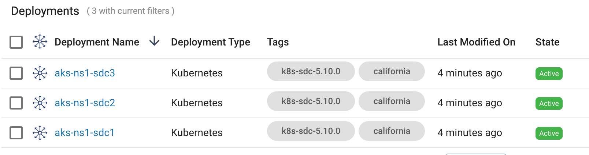

Confirm all the engines are accessible:

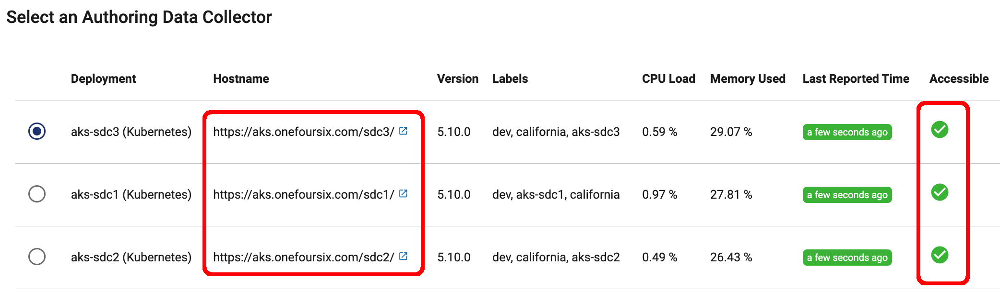

#### If you are using NodePort Services without an Ingress Controller

If you are using NodePort Services without an Ingress Controller, note the SDC URLS will have port numbers rather than paths, and if multiple deployments are created in a single run, the port numbers will be incremented for each SDC:

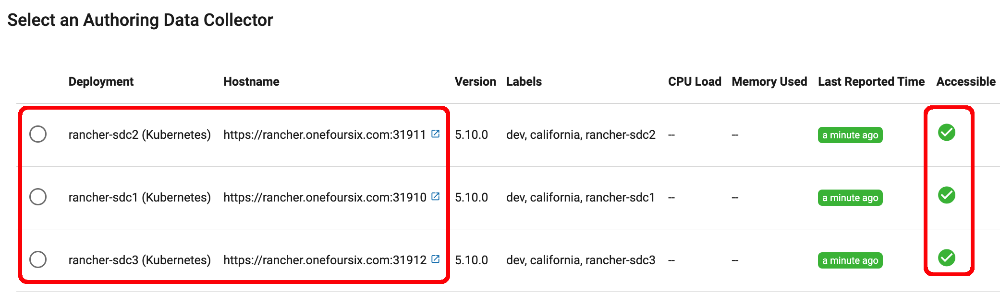
